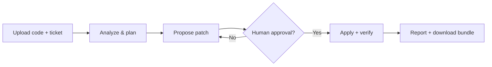

# Spec2Ship — AI Agentic Code Delivery Platform

## Intro
Spec2Ship v3 is an AI-assisted software delivery workflow for engineering teams. It helps you upload a real codebase, analyze issues, generate a plan, propose patches, wait for human approval, run verification, and export both reports and the modified source code. The project is designed for auditability, reproducibility, and practical DevOps usage.


## Tech stack
- **Frontend:** Next.js (React)
- **Backend API:** FastAPI (Python)
- **Background jobs:** RQ workers
- **Database:** PostgreSQL
- **Queue/Cache:** Redis
- **Containerization:** Docker + Docker Compose
- **AI integration:** Ollama (local inference), optional HF/ML workflows
- **Benchmarking/ML:** SWE-bench utilities in `ml/`

## Diagram (optional)


## Installation instructions for users
```bash
cp .env.example .env
docker compose up -d --build
```
After startup:
- UI: http://localhost:3000
- API docs: http://localhost:8000/docs
- Health check: http://localhost:8000/healthz

Quick usage:
1. Upload a `.zip` codebase in the UI.
2. Select a preset ticket or write a custom one.
3. Start a run and wait for patch proposal.
4. Review and approve the patch.
5. Download the final bundle (`artifacts/` + `workspace/`).

## Installation instructions for developers
Requirements:
- Docker + Docker Compose
- (Optional) Python 3.10+ for local non-container testing

Basic dev setup:
```bash
cp .env.example .env
docker compose -f docker-compose.dev.yml up -d --build
```

Run tests:
```bash
pytest -q
```

Main components:
- `web/`: Next.js frontend
- `backend/`: FastAPI API + pipeline services
- `ml/`: SWE-bench / training scripts
- `data/artifacts/`: per-run logs, diffs, reports

## Contributor expectations
- Follow the existing code style and naming conventions.
- Keep PRs small, focused, and easy to review.
- Run relevant tests before opening a PR.
- Never commit secrets or sensitive data.
- Use PR descriptions in this format: Problem → Approach → Validation.

## Known issues
- Patch quality depends on LLM quality and context retrieval.
- Low-resource local machines may hit verification timeouts.
- Some benchmark/ML pipelines still need production hardening.
