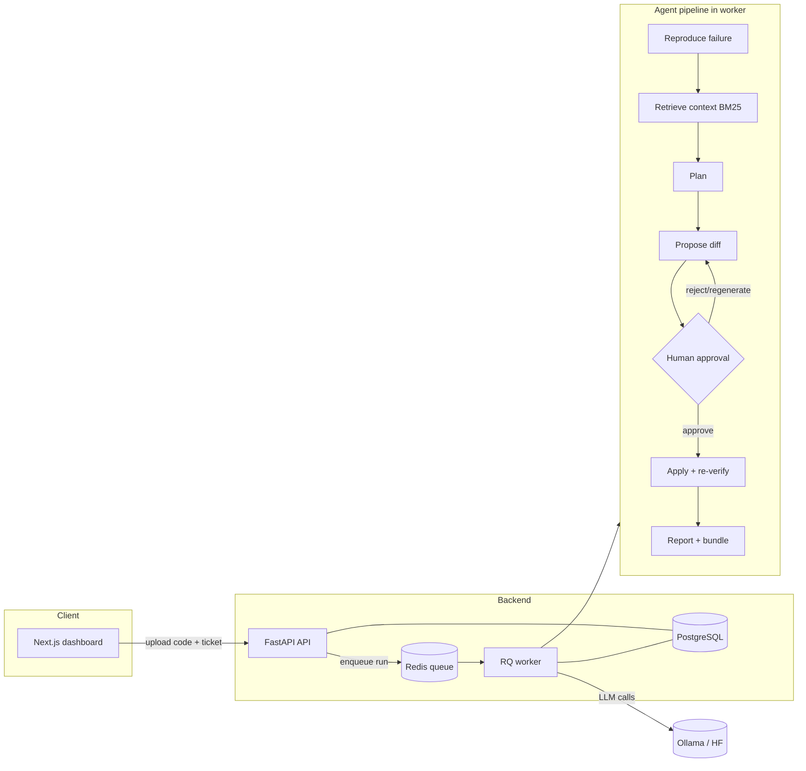

<div align="center">

# 🚀 Spec2Ship

### An agentic platform that turns a bug ticket into a reviewed, verified code patch — with a human in the loop.

[](https://github.com/Dung205789/Spec2Ship/actions/workflows/ci.yml)
[](LICENSE)
[](https://www.python.org/)
[](https://fastapi.tiangolo.com/)
[](https://nextjs.org/)
[](https://www.docker.com/)
[](https://github.com/astral-sh/ruff)

</div>

---

## What is Spec2Ship?

**Spec2Ship** is a local-first **agentic software-delivery pipeline**. You upload a real
codebase and a ticket ("fix the failing pricing tests"); the agent reproduces the
failure, retrieves relevant context, proposes a unified diff, **pauses for human
approval**, then applies the patch and re-verifies it — producing an auditable
report and a downloadable bundle at every step.

It is built around three ideas that matter for production agents:

1. **Verification, not vibes** — every patch is gated by reproducible checks
   (baseline → patch → re-check → smoke test). The agent only succeeds if the
   tests do.
2. **Human-in-the-loop by design** — no AI-generated change touches the codebase
   until a reviewer approves the proposed diff.
3. **Auditability** — each run is a state machine persisted to Postgres, and every
   step writes a plain-text artifact (log, diff, plan, report) you can open directly.

> 📄 **See a real run the agent produced:** [`docs/examples/sample-run/`](docs/examples/sample-run/)
> — it detected 3 rounding bugs in a sample shop and proposed a `Decimal`-based fix.

<div align="center">

</div>

---

## ✨ Key features

| | Feature | Description |
|---|---|---|
| 🤖 | **Agentic pipeline** | 11-stage loop: preflight → baseline → summarize → context retrieval → plan → propose → **approve** → apply → re-check → smoke → report |
| 🧑‍⚖️ | **Human-in-the-loop gate** | Runs block on `Waiting for approval`; a reviewer approves/rejects the diff before anything is applied |
| 🔌 | **Pluggable patch backends** | `rules` (offline, deterministic), `ollama` (local LLM, e.g. `qwen2.5-coder`), or `hf` (local Transformers + optional LoRA) |
| 🧠 | **Context retrieval (RAG-lite)** | BM25 over the workspace docs/code to ground the patch prompt — no heavyweight vector DB required |
| 🌐 | **Multi-language signal parsing** | Structured failure extraction for Python/pytest, JS/TS (Jest/Vitest), Go, and Rust |
| 🔒 | **Sandboxed workspaces** | Each run operates on an isolated copy with zip-bomb / path-traversal guards and per-command timeouts |
| 📊 | **SWE-bench harness** | `ml/` integrates the SWE-bench evaluation + a LoRA fine-tuning entrypoint |
| 📦 | **Reproducible & exportable** | Per-run artifacts on disk + a downloadable bundle (modified source + report) |

---

## 🏗️ Architecture


```mermaid
flowchart LR
    subgraph Client
      UI[Next.js dashboard]
    end
    subgraph Backend
      API[FastAPI API]
      Q[(Redis queue)]
      W[RQ worker]
      DB[(PostgreSQL)]
    end
    subgraph Agent[Agent pipeline in worker]
      direction TB
      P1[Reproduce failure] --> P2[Retrieve context BM25]
      P2 --> P3[Plan] --> P4[Propose diff]
      P4 --> HITL{Human approval}
      HITL -- reject/regenerate --> P4
      HITL -- approve --> P5[Apply + re-verify]
      P5 --> P6[Report + bundle]
    end

    UI -->|upload code + ticket| API
    API -->|enqueue run| Q --> W --> Agent
    API --- DB
    W --- DB
    W -->|LLM calls| OLL[(Ollama / HF)]
```

The system is split into clean layers (`api` → `use_cases` → `services` →
`repositories` → `db`), which keeps the agent logic pure and testable and the I/O
at the edges. See **[`docs/ARCHITECTURE.md`](docs/ARCHITECTURE.md)** for the deep dive.

### Tech stack

| Layer | Technology |
|---|---|
| Frontend | Next.js 14 (React 18) |
| API | FastAPI · Pydantic v2 |
| Async jobs | RQ workers on Redis |
| Persistence | PostgreSQL · SQLAlchemy 2.0 · Alembic migrations |
| LLM inference | Ollama (local) · HuggingFace Transformers + PEFT/LoRA |
| Retrieval | `rank-bm25` |
| Eval / research | SWE-bench harness (`ml/`) |
| Infra | Docker Compose · Makefile · GitHub Actions CI |

---

## 🚀 Quickstart

> Requires **Docker + Docker Compose**. That's it — Postgres, Redis, the API,
> the worker, and the web UI all come up together.

```bash
git clone https://github.com/Dung205789/Spec2Ship.git
cd Spec2Ship

make setup     # copy .env.example -> .env
make up        # build & start the full stack
```

| Service | URL |
|---|---|
| 🖥️  Web UI | http://localhost:3000 |
| 📚  API docs (Swagger) | http://localhost:8000/docs |
| ❤️  Health check | http://localhost:8000/healthz |

**Try it:**

1. Upload a `.zip` codebase (or use the bundled `sample_workspace/`).
2. Pick a preset ticket or write your own.
3. Start the run and watch the steps stream in.
4. Review the proposed diff → **Approve**.
5. Download the final bundle (modified source + report).

Want a local LLM proposing the patches instead of the rules engine?

```bash
make dev-llm        # starts an Ollama service alongside the stack
make pull-model     # pulls the model named in .env (default: qwen2.5-coder:7b)
```

---

## 🔬 How the agent works

Each run is an ordered state machine. Every stage persists its status and writes an
artifact you can inspect:

| # | Stage | What happens | Artifact |
|---|---|---|---|
| 1 | **Preflight** | Detect the workspace profile (language, test command) | `preflight.log` |
| 2 | **Baseline checks** | Run the existing test suite to reproduce the failure | `baseline.log` |
| 3 | **Summarize issues** | Parse tool output into structured `BugSignal`s | `signals.txt` |
| 4 | **Context search** | BM25-retrieve the most relevant files/docs | `context.md` |
| 5 | **Plan** | Draft an approach from the ticket + signals + context | `plan.md` |
| 6 | **Propose patch** | Generate a unified diff (`rules` / `ollama` / `hf`) | `proposal.diff` |
| 7 | **Waiting for approval** | ⏸️ Block until a human approves or rejects | — |
| 8 | **Apply patch** | `git apply` the approved diff to the isolated copy | `apply_result.txt` |
| 9 | **Re-run checks** | Re-execute the suite to confirm the fix | `post_checks.log` |
| 10 | **Smoke test** | Lightweight end-to-end sanity check | `smoke.log` |
| 11 | **Report** | Aggregate everything into a human-readable report | `report.md` |

If verification fails, the proposer can iterate (`PATCH_MAX_ATTEMPTS`,
`MAX_PATCH_ITERATIONS`) instead of shipping a broken change.

---

## 🧱 Project structure

```
Spec2Ship/
├── backend/                 # FastAPI app + agent pipeline
│   └── app/
│       ├── api/             # HTTP routes (runs, workspaces, artifacts, health)
│       ├── use_cases/       # Orchestration: run_pipeline, swebench eval/train
│       ├── services/        # Pure logic: bug_detector, diffing, kb (BM25), patches…
│       ├── repositories/    # DB access (runs / steps / artifacts)
│       ├── models/          # SQLAlchemy models
│       ├── schemas/         # Pydantic DTOs
│       └── tests/           # Unit tests for the pure services
├── web/                     # Next.js dashboard
├── ml/                      # SWE-bench harness + LoRA training
├── docs/                    # Architecture + a real sample run
├── sample_workspace/        # Bundled buggy "tinyshop" app to try the agent on
├── docker-compose*.yml      # base / dev / llm / train overlays
└── Makefile                 # one-command workflows
```

---

## 🧪 Development & testing

```bash
cd backend
python -m venv .venv && source .venv/bin/activate   # Windows: .venv\Scripts\activate
pip install -e ".[dev]"

ruff format . && ruff check .     # format + lint
pytest -q                          # run the unit suite
```

CI runs the same lint, format-check, and tests on every push/PR, plus a Next.js
build and a Docker Compose config validation. See
[`.github/workflows/ci.yml`](.github/workflows/ci.yml) and
[`CONTRIBUTING.md`](CONTRIBUTING.md).

---

## ⚙️ Configuration

All settings live in `.env` (copied from [`.env.example`](.env.example)) and are
loaded via Pydantic Settings. Highlights:

| Variable | Purpose | Default |
|---|---|---|
| `PATCHER_MODE` | Patch backend: `rules` / `ollama` / `hf` | `rules` |
| `OLLAMA_MODEL` | Local model for patch generation | `qwen2.5-coder:7b` |
| `ISOLATE_WORKSPACES` | Run each job on an isolated copy | `true` |
| `WORKSPACE_UPLOAD_MAX_BYTES` | Upload-size guard (zip-bomb defense) | 200 MB |
| `*_SECONDS` | Per-command timeouts (preflight, smoke, apply, test…) | tuned for local |

> Defaults are tuned for a laptop. Production guidance (longer timeouts, bigger
> context) is documented inline in [`backend/app/core/config.py`](backend/app/core/config.py).

---

## 💡 Engineering highlights

A few decisions worth calling out (and the reasoning behind them):

- **Layered, dependency-inverted design** — agent logic is pure and unit-tested;
  side effects (DB, filesystem, shell, LLM) sit behind `repositories`/`services`.
- **Determinism first** — the default `rules` patcher means the whole pipeline
  works, is testable, and is demoable **without** any model or API key.
- **Safety for untrusted input** — Spec2Ship runs commands against user-uploaded
  code, so isolation, resource limits, and timeouts are first-class (see
  [`SECURITY.md`](SECURITY.md)).
- **Observability** — plain-text artifacts per step make every agent decision
  inspectable without special tooling.

---

## 🗺️ Roadmap

- [ ] Streaming step updates over WebSocket/SSE in the UI
- [ ] Richer retrieval (AST-aware chunking, optional embeddings)
- [ ] Multi-file, dependency-aware patch planning
- [ ] Eval dashboard for SWE-bench resolve-rate over time
- [ ] Pluggable cloud LLM providers behind the existing patcher interface

---

## 📜 License

Released under the [MIT License](LICENSE).

<div align="center">

Built by [**Ngo Quang Dung**](https://github.com/Dung205789) · contributions welcome — see [CONTRIBUTING.md](CONTRIBUTING.md)

</div>
