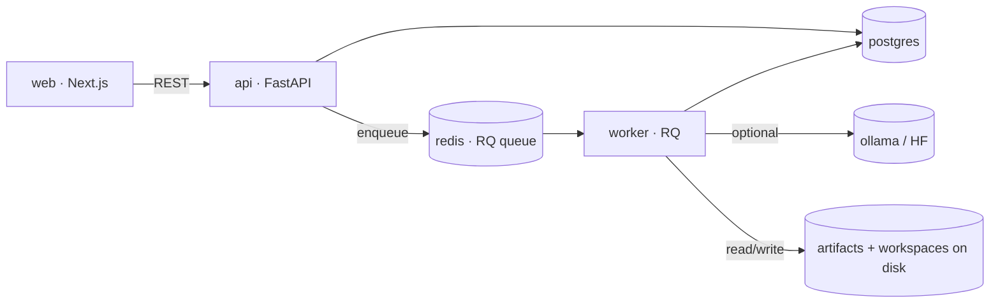
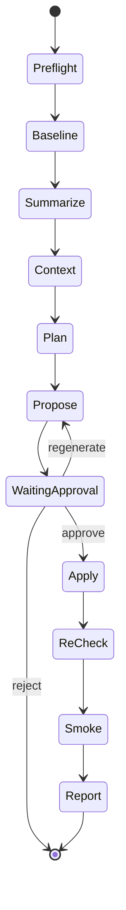

# Architecture

Spec2Ship is a local-first agentic pipeline that takes a **ticket + codebase** and
produces a **reviewed, verified patch**. This document explains the runtime
topology, the request lifecycle, the data model, and the key design decisions.

## 1. Runtime topology



| Service | Role |
| --- | --- |
| **web** (Next.js) | Dashboard: create runs, watch steps stream, approve/reject diffs, download bundles |
| **api** (FastAPI) | REST API; validates input, persists runs, enqueues jobs |
| **worker** (RQ) | Executes the agent pipeline and writes artifacts |
| **postgres** | Stores run / step / artifact metadata |
| **redis** | Job queue + transient state |
| **ollama / hf** | Optional LLM inference backends for patch generation |

The stack is defined in `docker-compose.yml` with overlays:
`docker-compose.dev.yml` (hot reload), `docker-compose.llm.yml` (Ollama), and
`docker-compose.train.yml` (LoRA training).

## 2. Layered backend

The backend follows a dependency-inverted, layered design so the agent logic stays
pure and testable while I/O lives at the edges:

```
api/            HTTP boundary — thin routers, request/response only
  └── use_cases/   orchestration — the RunPipeline state machine
        └── services/    pure logic — bug_detector, diffing, kb (BM25), patches…
              └── repositories/   persistence — runs / steps / artifacts
                    └── db/ + models/   SQLAlchemy session & ORM models
```

- **`services/` is import-pure** — no FastAPI, no request objects. This is why the
  unit tests in `app/tests/` can exercise `BugDetector`, `KnowledgeBase`,
  `unified_diff`, and the directive parser without a database or a container.
- **`repositories/`** wrap all DB access, so use-cases never touch SQLAlchemy
  sessions directly.
- **`core/config.py`** centralizes configuration via Pydantic Settings (env-driven).

## 3. Run lifecycle (the agent loop)

A run is an **ordered state machine**. The worker advances it one step at a time,
persisting status and an artifact at each stage:



1. **Preflight** — detect the workspace profile (language + test commands) via
   `services/workspace_profile.py`.
2. **Baseline checks** — run the existing suite to *reproduce* the failure.
3. **Summarize issues** — `services/bug_detector.py` parses tool output into typed
   `BugSignal`s (Python/JS/Go/Rust).
4. **Context search** — `services/kb.py` does BM25 retrieval over workspace
   docs/code to ground the prompt.
5. **Plan** — draft an approach from ticket + signals + context.
6. **Propose patch** — `services/patches.py` produces a unified diff via the
   configured backend (`rules` / `ollama` / `hf`).
7. **Waiting for approval** — the run blocks until a human calls
   `POST /runs/{id}/patch_decision?decision=yes|rejected`.
8. **Apply patch** — `git apply` the approved diff to the isolated run workspace.
9. **Re-run checks** — re-execute the suite to confirm the fix.
10. **Smoke test** — lightweight end-to-end sanity check.
11. **Report** — aggregate logs/diffs/results into `report.md`.

Failed verification can trigger bounded re-proposal (`PATCH_MAX_ATTEMPTS`,
`MAX_PATCH_ITERATIONS`) rather than shipping a broken change.

## 4. Patch backends

All proposers implement the same interface (`propose()` → diff, `apply()` → result),
so they're swappable per run via `POST /runs/{id}/switch_patcher`:

| Mode | Backend | Use case |
| --- | --- | --- |
| `rules` | Deterministic, offline heuristics | Default — works with no model/API key; fully testable |
| `ollama` | Local LLM (e.g. `qwen2.5-coder:7b`) | Realistic generation, fully local/private |
| `hf` | HuggingFace Transformers + optional LoRA | Research / fine-tuned adapters |

## 5. Data model

| Table | Description |
| --- | --- |
| `runs` | One row per workflow run (ticket, workspace, status) |
| `steps` | Ordered state machine rows per run (name, status, summary) |
| `artifacts` | Pointers to files on disk (logs, diffs, plan, report) |

Schema is managed with **Alembic** (`backend/app/alembic/`).

## 6. Artifacts

Artifacts are stored as plain files under `data/artifacts/<run_id>/...`. This keeps
every agent decision **inspectable without special tooling** — open the log, diff,
plan, or report directly. A curated example lives in
[`examples/sample-run/`](examples/sample-run/).

## 7. Safety model

Spec2Ship executes commands and applies AI-generated patches against
**untrusted, user-uploaded code**, so the following are first-class (see
[`../SECURITY.md`](../SECURITY.md)):

- Per-run workspace **isolation** (`ISOLATE_WORKSPACES`).
- Upload/extraction **limits** (zip-bomb & path-traversal defense).
- Explicit **timeouts** on every shell/git/test command.
- A mandatory **human-approval gate** before any patch is applied.
